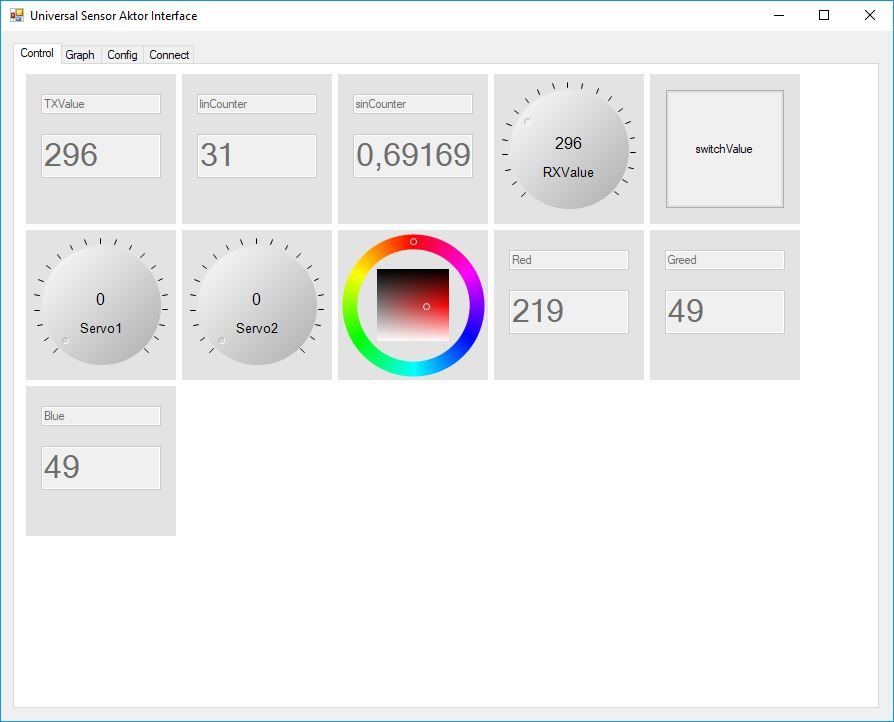

# USAI_GUI
GUI for my "Universal Sensor Actor Interface" (USAI) library for Arduino

Downdload the library from: 
https://github.com/4ndreas/USAI

The library uses a simple ASCII-protocoll to transfer data.
| Name | : | Value |\r\n|

The data of the example recived by the serial port looks like:
```
potiValue:0<\r><\n>
TXValue:296<\r><\n>
linCounter:122<\r><\n>
sinCounter:0.135105<\r><\n>
Red:219<\r><\n>
Greed:49<\r><\n>
Blue:49<\r><\n>
```

The GUI can display different controls depended on the variables set in the Arduino
Actor
- Boolean to button
- int and float to knob dails
- int32_t to RGB color selector

Sensors
- int, float to value



To display time depended values graphs can be selected in the config tab


Currently Serial and UDP connections are supported
- Serial select the Port and baudrate
- UDP select IP and Port


# To do:
- add CRC for serial connection
- binarry protocol
- add TCP
- save graphs and values
- Improve MIDI interface
- ... many more ideas 


Credits:

I used Leslie Sanford's C# MIDI Toolkit for the Midi interactions
from: https://www.codeproject.com/Articles/6228/C-MIDI-Toolkit
The color selector ist form https://unclassified.software/de/source/colorfader
